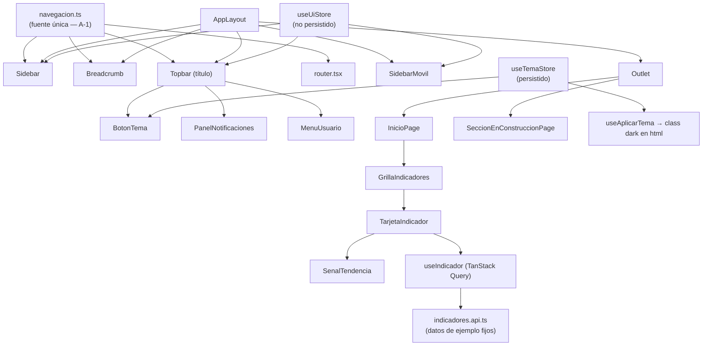
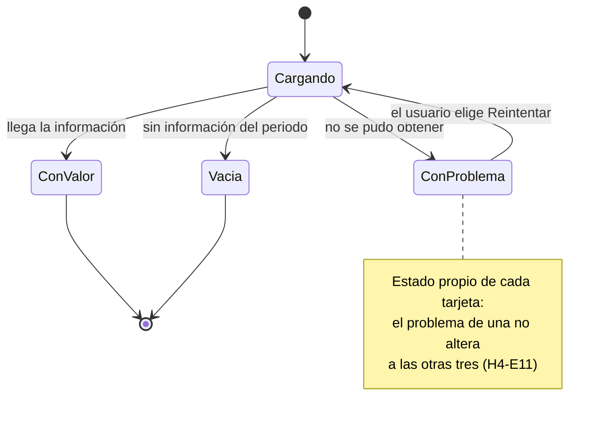

<!-- Documentación Técnica generada en Fase 7.8.2 del flujo SDD AmigoXCD -->
<!-- Fuentes: layout-base-y-dashboard-spec.md, -plan.md, -verify.md, -review.md, -peer-review.md, diff real del código (commits 3c6ce6b..afbed40) -->

# Documentación Técnica — Layout Base y Dashboard

## 1. Resumen ejecutivo

- **Qué hace:** entrega el punto de partida visual del sistema MIGIVA: el shell reutilizable (sidebar, topbar, breadcrumb) que usarán todas las pantallas futuras, más su primera pantalla real — "Inicio" con cuatro indicadores del negocio. Es una entrega solo de pantalla: sin backend, sin base de datos, con datos de ejemplo fijos.
- **Módulo / Sistema:** Layout · MIGIVA
- **Dominio / Stack:** Frontend · React 19.2 + TypeScript + Vite 7 (`vite: ^8.2.0` instalado) + Tailwind CSS 4 + shadcn/ui (perfil `react-frontend`)
- **Tarea ClickUp:** https://app.clickup.com/t/86ajtv468
- **PR:** pendiente
- **Estado Verify:** ✅ pass (`layout-base-y-dashboard-verify.md` — 94/94 escenarios cumplidos, 0 fallos, 0 pendientes)

## 2. Arquitectura y decisiones de diseño

La solución es **greenfield**: el repositorio no tenía `package.json` ni `src/` antes de esta spec (plan §1, AS-IS). Se construyó en 9 bloques secuenciales (andamiaje → contratos → datos → stores → shell → pantalla Inicio → rutas → pruebas → Peer Review), documentados en el Registro de Ejecución del plan (§10, 9 bloques).

Decisiones técnicas clave (`layout-base-y-dashboard-plan.md` §2, A-1 a A-12):

| Decisión | Alternativas consideradas | Por qué esta |
|----------|---------------------------|--------------|
| **A-1** — Fuente única de navegación en `src/app/navegacion.ts` (`SECCIONES_MENU`); sidebar, breadcrumb, topbar y router derivan de ahí | Declarar la estructura por separado en cada consumidor | AF-1 fija nombres y orden exactos; duplicar la lista los haría divergir en silencio (rompería H1-E7 vs. H1-E2) |
| **A-2** — Estado de servidor con TanStack Query, un `useQuery` por indicador (`queryKey: ['indicador', id, modo, latenciaMs]`) aunque los datos sean fijos | Estado local con `useState`/`useEffect` manual | H4 exige carga, vacío, error y reintento *por tarjeta* (H4-E11); es exactamente `isPending`/`isError`/`refetch` por query, y deja el punto de enganche listo para el backend real |
| **A-3** — Zustand en dos stores separados: `useUiStore` (sin persistir) y `useTemaStore` (persistido en `localStorage`) | Un solo store persistido con exclusión de campos | AF-18 exige que solo el tema sobreviva a la recarga (H2-E6); dos stores hacen la diferencia estructural en vez de una lista de exclusión |
| **A-4** — `panelAbierto` modelado como enum (`'ninguno' \| 'usuario' \| 'notificaciones'`) en `useUiStore` | Dos booleanos independientes | AF-14/H5-E13: con un enum, "ambos paneles abiertos" es inexpresable; con dos booleanos hay que prohibirlo con lógica |
| **A-5/A-6** — Tailwind CSS 4 config CSS-first (`@theme`, sin `tailwind.config.js`); modo oscuro con clase `.dark` en `<html>` vía `useAplicarTema` | Config JS de Tailwind 3; tema por CSS media query | Es el contrato que shadcn/ui y Tailwind 4 esperan; ningún componente necesita lógica condicional de tema (H6-E5/E6 "gratis") |
| **A-7** — Estados de tarjeta anunciados con `aria-live="polite"` local por tarjeta, no `role="alert"` global | Región de anuncio única para toda la pantalla | H4-E12/E13 exigen anuncio sin mover el foco, y H4-E11 exige independencia entre tarjetas |
| **A-8** — Orden de tabulación logrado con el orden del DOM, sin `tabIndex` positivos | `tabIndex` explícitos por elemento | AF-15 fija el orden exacto; los positivos son frágiles y rompen la relación lectura/recorrido |
| **A-9 ⚠️** — Tema por defecto **claro fijo**, no `prefers-color-scheme` | Respetar la preferencia del sistema operativo (como indica el DESIGN.md) | **Conflicto documentado entre Spec y DESIGN.md** (ver nota abajo) — la spec aprobada (H6-E1, AF-19) manda por jerarquía de autoridad de la Constitución |
| **A-10** — Textos literales centralizados en `src/lib/textos.ts` | Strings inline por componente | Los textos exactos son criterio de aceptación (AF-5, AF-6, AF-8, AF-9, AF-10); centralizarlos impide que Verify pase con un texto y la UI muestre otro |
| **A-12** — Vitest + Testing Library, agrupando tests por componente/pantalla (11 archivos, 94 escenarios trazados) | Un archivo de test por escenario BDD | 94 archivos habría sido inmanejable sin ganar cobertura; la trazabilidad la da la matriz del plan §5 |

> **Conflicto A-9 (documentado, no resuelto por el agente):** el plan (`layout-base-y-dashboard-plan.md` §2.1) registra una desviación real entre la spec aprobada (tema claro fijo por defecto) y el DESIGN.md oficial (respetar `prefers-color-scheme` por defecto). Se implementó lo que exige la spec aprobada, siguiendo la jerarquía de autoridad de la Constitución (Spec Aprobada > Plan). Queda como decisión pendiente de confirmación explícita del negocio si se desea alinear a futuro con el DESIGN.md (requeriría observar la spec).

- **Diagramas** (reusados de `layout-base-y-dashboard-plan.md` §4, sin modificar):

## 3. Cambios por capa

Única capa: **Frontend**. No hay Base de datos ni Backend en esta entrega (spec §"Qué NO incluye esta entrega"; plan §1 AS-IS). Inventario derivado del árbol real bajo `src/` y del Registro de Ejecución del plan (§10) — proyecto greenfield, primer conjunto de commits (`3c6ce6b`…`afbed40`).

### 🗄️ Base de datos
No aplica — esta entrega no crea ningún objeto de base de datos (plan §1, §7, §9: "N/A — no se crea ningún objeto").

### ⚙️ Backend
No aplica — sin endpoints ni servicio de servidor (plan §6: "Sin archivo `.http`: esta entrega no expone endpoints").

### 📱 Frontend

**Aplicación y rutas**

| Componente | Archivo:línea | Responsabilidad |
|------------|---------------|-----------------|
| `SECCIONES_MENU` | `src/app/navegacion.ts:17` | Fuente única de las 6 secciones/subsecciones, iconos y rutas (A-1, AF-1) |
| `AppProviders` | `src/app/providers.tsx:39` | `QueryClientProvider` (`retry: false`) + sincroniza el tema al montar |
| `router` | `src/app/router.tsx:32` | `createBrowserRouter` con 8 rutas anidadas bajo `AppLayout`, ninguna protegida (AF-24) |

**Shell reutilizable (`src/components/layout/`)**

| Componente | Archivo:línea | Responsabilidad |
|------------|---------------|-----------------|
| `AppLayout` | `src/components/layout/AppLayout.tsx:51` | Ensambla sidebar + topbar + breadcrumb + `<Outlet/>`; `h-dvh overflow-hidden` para cero scroll horizontal 360–1440px |
| `Sidebar` | `src/components/layout/Sidebar.tsx:27` | Lista las 6 secciones, colapsa/expande, despliega Comercial/Packing |
| `SidebarSeccion` | `src/components/layout/SidebarSeccion.tsx:58` | Ítem de menú: icono + nombre, marca activa (barra + `aria-current`), tooltip colapsado. Usa `Link` (no `NavLink`) tras el fix de marca activa del bloque 8 |
| `SidebarMovil` | `src/components/layout/SidebarMovil.tsx:46` | El mismo contenido dentro de un `Sheet` deslizable; cierra solo con clic en un `<a>` real (fix T9.2/PRT-4/PRT-12) |
| `Topbar` | `src/components/layout/Topbar.tsx:31` | Título de la pantalla + tema, campana y avatar en el orden de foco de AF-15 |
| `Breadcrumb` | `src/components/layout/Breadcrumb.tsx:27` | Ruta derivada de `navegacion.ts`; solo el primer nivel navega |
| `BotonTema` | `src/components/layout/BotonTema.tsx:18` | Alterna claro/oscuro contra `useTemaStore` |
| `PanelNotificaciones` | `src/components/layout/PanelNotificaciones.tsx:32` | Campana + panel con 3 avisos de ejemplo; cierre por clic fuera y Escape |
| `MenuUsuario` | `src/components/layout/MenuUsuario.tsx:34` | Avatar + nombre; "Mi perfil"/"Cerrar sesión" muestran aviso honesto |
| `AnuncioPantalla` | `src/components/layout/AnuncioPantalla.tsx:21` | Región `aria-live` que anuncia el título al cambiar de ruta (H7-E21) |
| `EnConstruccion` | `src/components/shared/EnConstruccion.tsx:20` | Aviso honesto nombrando la sección elegida |

**Pantalla Inicio (`src/features/dashboard/`, `src/pages/`)**

| Componente | Archivo:línea | Responsabilidad |
|------------|---------------|-----------------|
| `InicioPage` | `src/pages/InicioPage.tsx:15` | Pantalla Inicio (sin gráficos, sin tabla) |
| `SeccionEnConstruccionPage` | `src/pages/SeccionEnConstruccionPage.tsx:22` | Resuelve la sección desde la ruta y renderiza `EnConstruccion` |
| `GrillaIndicadores` | `src/features/dashboard/components/GrillaIndicadores.tsx:20` | 4 tarjetas: 1 columna en móvil, 1 fila en escritorio |
| `TarjetaIndicador` | `src/features/dashboard/components/TarjetaIndicador.tsx:66` | Los 4 estados del indicador + `aria-live` + "Reintentar" — contrato reutilizable (AF-7/RN-35) |
| `SenalTendencia` | `src/features/dashboard/components/SenalTendencia.tsx:34` | Flecha ↑ / ↓ / raya, con color **y** forma (AF-4) |
| `useIndicador` | `src/features/dashboard/hooks/useIndicador.ts:28` | `useQuery` con `queryKey: ['indicador', id, modo, latenciaMs]` (ver §9, fix T9.3) |
| `obtenerIndicador` | `src/features/dashboard/api/indicadores.api.ts:55` | "Endpoint" simulado con latencia (`LATENCIA_SIMULADA_MS = 600`), sin red real (RN-36) |
| `indicadoresMock` | `src/features/dashboard/data/indicadores.mock.ts:15` | Valores de ejemplo fijos (AF-2, AF-3) |
| `notificacionesMock` | `src/features/notificaciones/data/notificaciones.mock.ts:24` | 3 avisos de ejemplo del negocio agro (AF-11) |

**Estado de cliente y utilidades**

| Componente | Archivo:línea | Responsabilidad |
|------------|---------------|-----------------|
| `useUiStore` | `src/stores/useUiStore.ts:41` | Sidebar colapsado, menú móvil, `panelAbierto` (enum, A-4) — **sin** `persist` (A-3, RN-11) |
| `useTemaStore` | `src/stores/useTemaStore.ts:28` | Tema `'claro' \| 'oscuro'`, default `'claro'` (A-9), **con** `persist` (`layout.tema`, `version: 1` desde el fix T9.1/PRT-2) |
| `useAplicarTema` | `src/hooks/useAplicarTema.ts:17` | Efecto que aplica la clase `dark` a `document.documentElement` (A-6) |
| `textosIndicador` / `textosEnConstruccion` / `textosMenuUsuario` | `src/lib/textos.ts:15,28,47` | Literales exactos exigidos por AF-5, AF-6, AF-8, AF-9, AF-10 (A-10) |

## 4. Contrato de API (si aplica)

No aplica. Esta entrega es frontend puro sin endpoints expuestos (spec §"Qué NO incluye esta entrega"; plan §6). El único punto de datos es `obtenerIndicador()` en `src/features/dashboard/api/indicadores.api.ts:55`, una función en memoria con latencia simulada — no un servicio HTTP. Cuando exista backend real, este es el punto de enganche previsto (plan §7).

No hay archivo `.http` generado (no aplica a esta spec).

## 5. Modelo de datos (si aplica)

No aplica. No hay tablas, columnas, índices ni constraints — no se toca ninguna base de datos en esta entrega (plan §1, §5 implícito por ausencia; §7 confirma "no hay backend").

## 6. Configuración y despliegue

- **Variables / settings nuevos o modificados:** ninguno (no hay `.env` ni configuración de entorno; ver `package.json` — sin dependencias de runtime que requieran claves).
- **Pasos de release:** `npm install` → `npm run build` (`tsc -b && vite build`) → servir el artefacto estático de `vite build`. Sin scripts SQL, sin migraciones.
- **Dependencias nuevas (`package.json`):** `react@19.2.8`, `react-dom@19.2.8`, `react-router@7.18.2`, `@tanstack/react-query@5.101.4`, `zustand@5.0.14`, `tailwindcss@4.3.3` + `@tailwindcss/vite@4.3.3`, `radix-ui@1.6.7`, `class-variance-authority@0.7.1`, `clsx@2.1.1`, `tailwind-merge@3.6.0`, `lucide-react@1.28.0`. Dev: `vite@8.2.0`, `vitest@4.1.10`, `@testing-library/react@16.3.2`, `@testing-library/jest-dom@7.0.0`, `jsdom@30.0.1`, `typescript@6.0.2`, `eslint@10.8.0` + plugins.

## 7. Rollback

Derivado de `layout-base-y-dashboard-plan.md` §9 (Plan de Rollback Global) — riesgo bajo, nada destructivo.

- **Orden de reversión:** Frontend únicamente (no hay Backend ni BD). Dentro del frontend, orden inverso al de construcción: bloque 9 (Peer Review) → 8 (pruebas) → 7 (rutas) → 6 (pantalla Inicio) → 5 (shell) → 4 (stores) → 3 (datos) → 2 (contratos) → 1 (andamiaje). Revertir el bloque 8 no rompe la app; revertir el bloque 5 (shell) invalida los bloques 6 y 7.
- **Punto sin retorno:** ninguno dentro de esta entrega. El único efecto persistente en el entorno del usuario es la clave `layout.tema` en `localStorage`, que se limpia sola si la aplicación deja de leerla.
- **Scripts:** no aplica — no hay `Database/[Módulo]/06-Rollback/` porque no se creó ningún objeto de base de datos.
- **Mecanismo de reversión por bloque:** `git revert` del commit correspondiente (`3c6ce6b`…`afbed40`, ver §10 Referencias).

## 8. Verificación (evidencia)

Resumen de `layout-base-y-dashboard-verify.md` (ejecutado 2026-08-01 12:17, cerrado 2026-08-01):

- **7 de 7 historias verificadas** (P1: 4/4 · P2: 3/3) — 94 escenarios `H#-E#` totales, **94 cumplidos, 0 fallidos, 0 pendientes**.
- **Tests del stack:** `npx vitest run` → **80 pasados / 0 fallados / 80 total**, 11 archivos de test, 5.31s.
- **Smoke E2E real en navegador** (agente Frontend Developer + `chrome-devtools`, contra `http://localhost:5173/` — Vite dev server real, no simulado): 14 puntos verificados a 1440px y ~502px (nota de entorno: `resize_page` no forzó los 360px exactos por un mínimo de la ventana real del MCP; el ancho exacto de 360px queda cubierto de forma determinística por el test `U-10`/`responsive.test.tsx` vía JSDOM). **0 errores de consola** en toda la sesión.
- No aplica archivo `.http` — spec frontend puro sin endpoints (ver §4).
- Detalle completo escenario por escenario: ver `.specs/Layout/layout-base-y-dashboard-verify.md`.

## 9. Riesgos y deuda técnica conocida

Consolidado de `layout-base-y-dashboard-review.md` (Review pre-PR, tier 2, 0 críticos) y `layout-base-y-dashboard-peer-review.md` (Peer Review qwen3.7-max, `passed_with_findings`, 5 hallazgos aceptados de 17 técnicos + 7 refutados por el filtro adversarial).

| Riesgo / deuda | Impacto | Mitigación / seguimiento |
|----------------|---------|--------------------------|
| `src/App.css` — boilerplate de `create-vite` (`.hero`, `#next-steps`, `.ticks`) sin referencia en el código | Bajo (código muerto, confirmado por grep) | Review 🟡 #1 — pendiente, aceptado sin bloquear. Eliminar el archivo en un fix rápido posterior |
| `public/icons.svg` — sprite de iconos sociales del scaffolding, sin referencia desde `index.html` ni `src/` | Bajo (código muerto) | Review 🟡 #2 — pendiente, aceptado sin bloquear. Eliminar el archivo |
| Comentarios desactualizados citando `NavLink` en vez de `Link` (`router.tsx:16`, `Breadcrumb.tsx:22`, `test/utils.tsx:7`) | Muy bajo (solo documentación inline) | Review 🟢 #1-3 — pendiente, aceptado sin bloquear |
| `useTemaStore` sin `version`/`migrate` en el `persist` | Bajo — hidratación incompatible ante un futuro cambio de forma del estado | ✅ **Resuelto** (T9.1/PRT-2, commit `afbed40`): se agregó `version: 1` (`src/stores/useTemaStore.ts:38`) |
| `SidebarMovil` cerraba el panel con cualquier clic dentro del `<nav>`, no solo en un enlace | Medio — UX: clic en padding vacío cerraba el menú móvil sin navegar | ✅ **Resuelto** (T9.2/PRT-4/PRT-12, commit `afbed40`): el cierre ahora exige `target.closest('a')` (`src/components/layout/SidebarMovil.tsx:65`) |
| `useUiStore` no documentaba por qué `sidebarColapsado`/`menuMovilAbierto` no persisten | Bajo — claridad para el equipo, no funcional | ✅ **Resuelto** (T9.4/PRT-13, commit `afbed40`): comentario explícito de diseño intencional (`src/stores/useUiStore.ts:34`) |
| `src/index.css` cargaba la fuente Nunito desde Google Fonts (CDN externo) | Bajo — punto de fallo externo en app corporativa | ✅ **Resuelto** (T9.5/PRT-15, commit `afbed40`): fuente autoalojada como variable local (`src/assets/fonts/nunito-variable-latin.woff2`, subset latin) |
| **Regresión de test por el fix de `queryKey` (T9.3/PRT-6/PRT-16)** — ver detalle abajo | Medio, ya resuelto en el mismo bloque | Ver nota dedicada más abajo |
| 9 hallazgos técnicos adicionales del Peer Review descartados con justificación auditable (PRT-1, PRT-3, PRT-5, PRT-7 a PRT-11, PRT-14, PRT-17) + 7 refutados por el filtro adversarial (PRF-1 a PRF-7) | N/A — no se aceptaron como deuda | Ver `.specs/Layout/layout-base-y-dashboard-peer-review.md` para el razonamiento completo de cada descarte |
| Conflicto A-9 (tema por defecto claro fijo vs. `prefers-color-scheme` del DESIGN.md) | Bajo funcionalmente (spec cumplida), pendiente de decisión de negocio si se quiere alinear al DESIGN.md a futuro | Documentado en plan §2.1; requeriría observar la spec aprobada por vía formal si se decide cambiar |

### Nota técnica: regresión RN-20 detectada y resuelta en el Bloque 9 (Peer Review)

Durante el Peer Review (Fase 7.7) se aceptaron los hallazgos **PRT-6/PRT-16**: la `queryKey` de `useIndicador` (`['indicador', id]`) no incluía los parámetros `modo` y `latenciaMs`, por lo que cambiar el modo simulado de un indicador (por ejemplo, de `'con-valor'` a `'falla'`) manteniendo el mismo `id` podía devolver una respuesta cacheada del modo anterior en vez de ejecutar la nueva consulta — rompiendo el aislamiento y la previsibilidad que documenta el hook (A-2, A-7 de la Constitución).

El fix (`src/features/dashboard/hooks/useIndicador.ts:34`, commit `afbed40`) amplió la `queryKey` a `['indicador', id, modo, latenciaMs]`. Este cambio, aplicado en la misma wave del Bloque 9, **rompió el test existente de RN-20** en `TarjetaIndicador.test.tsx`: ese test simulaba "la API se recuperó tras Reintentar" cambiando la prop `modo` entre renders (`rerender`) — con la `queryKey` ampliada, ese cambio de prop generaba una entrada de cache nueva que TanStack Query fetcheaba automáticamente (la query es `enabled` por defecto) *antes* de que el usuario hiciera clic en "Reintentar", adelantando el estado de carga y rompiendo la aserción del test.

**Diagnóstico:** no era una regresión de producción — `InicioPage` nunca varía `modo`/`latenciaMs` en un montaje real, solo el test usaba esa técnica como atajo para simular la recuperación de la API. La causa raíz fue la **técnica del test**, no el hook.

**Resolución:** se corrigió el test (`src/features/dashboard/__tests__/TarjetaIndicador.test.tsx:119-166`) para mockear la recuperación con `vi.spyOn(indicadoresApi, 'obtenerIndicador')` (primera llamada rechaza, segunda resuelve con éxito) en lugar de cambiar `modo` entre renders — ejercitando el flujo real de "Reintentar" vía `refetch()` sin depender de props mutables por fuera del ciclo de vida real del componente. `useIndicador.ts` no requirió más cambios. Suite completa verde tras el fix (80/80, `npm run build` y `npx tsc --noEmit` limpios).

## 10. Referencias

- Spec: `.specs/Layout/layout-base-y-dashboard-spec.md`
- Plan: `.specs/Layout/layout-base-y-dashboard-plan.md`
- Verify: `.specs/Layout/layout-base-y-dashboard-verify.md`
- Review: `.specs/Layout/layout-base-y-dashboard-review.md`
- Peer Review: `.specs/Layout/layout-base-y-dashboard-peer-review.md`
- Mockup navegable: `.specs/Layout/mockups/layout-base-y-dashboard-mockup.html`
- Commits: `3c6ce6b` (andamiaje) … `afbed40` (fix Peer Review) — 9 commits en `feat/layout-base-y-dashboard`
- Manual de usuario: pendiente (se genera en el mismo paso de Fase 7.8, artefacto separado)
