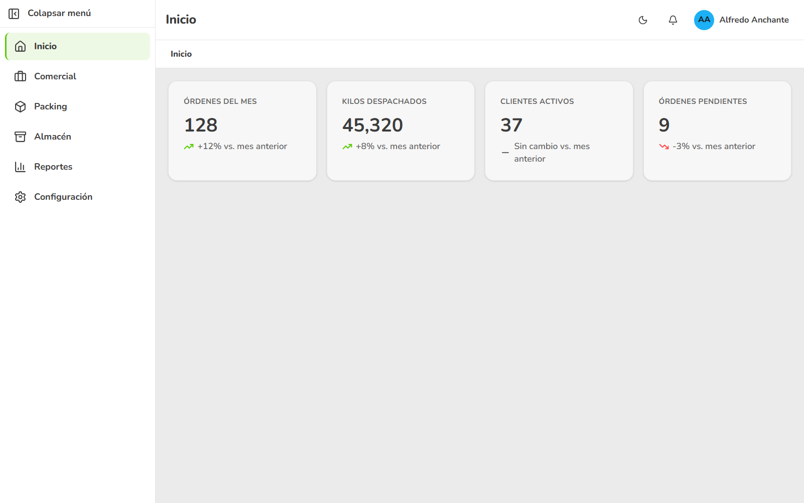
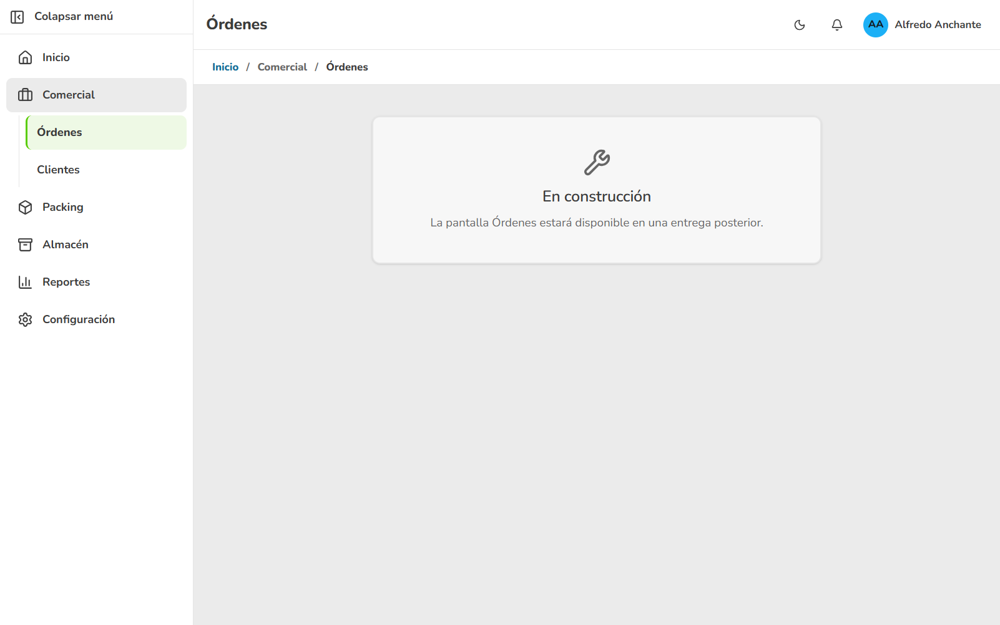
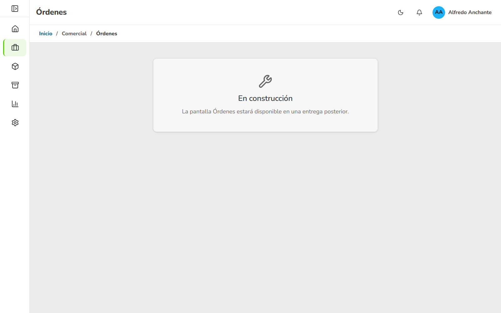
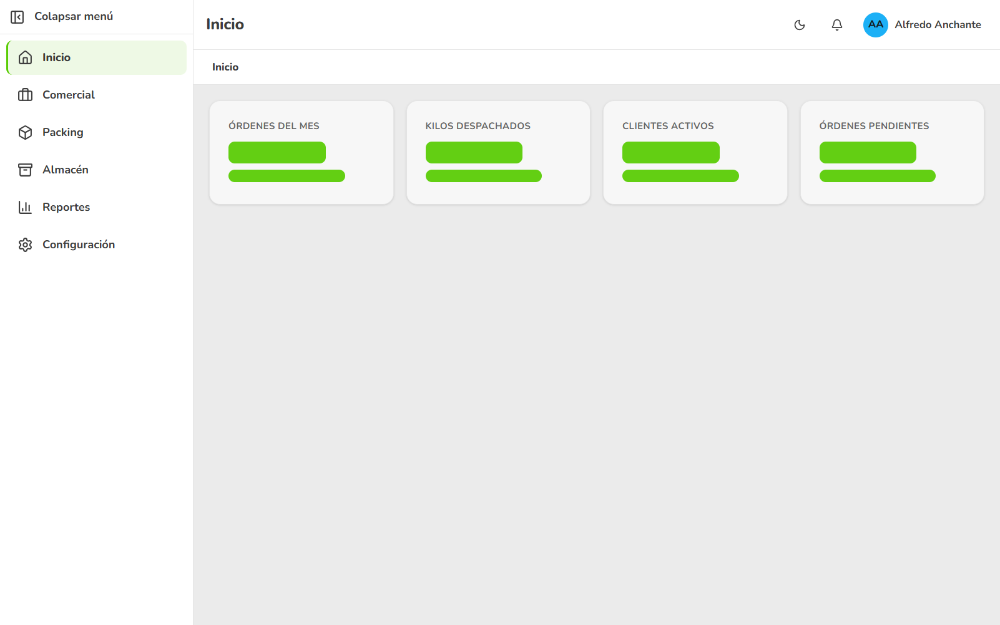
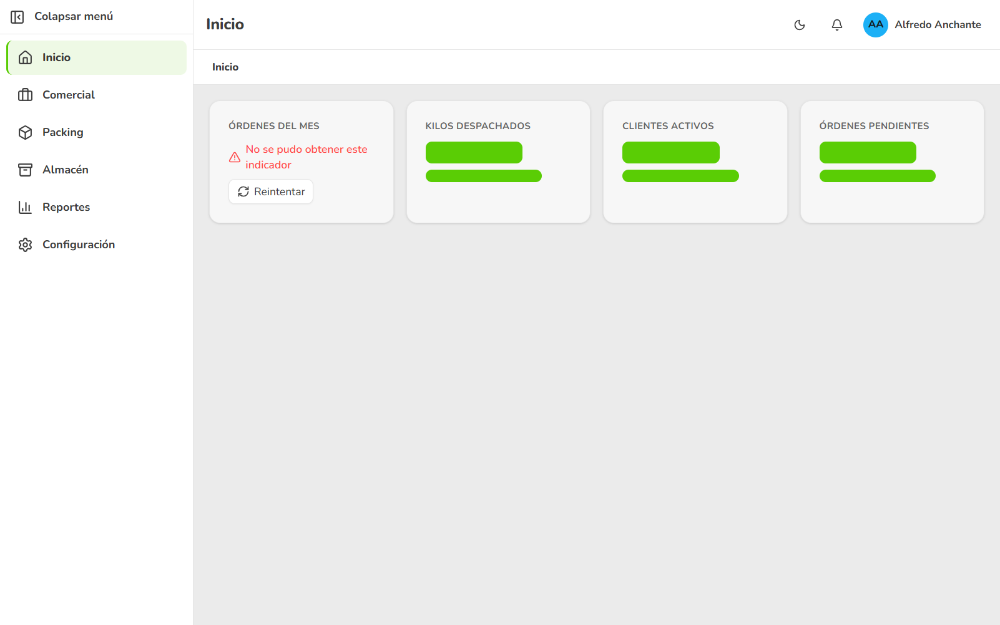
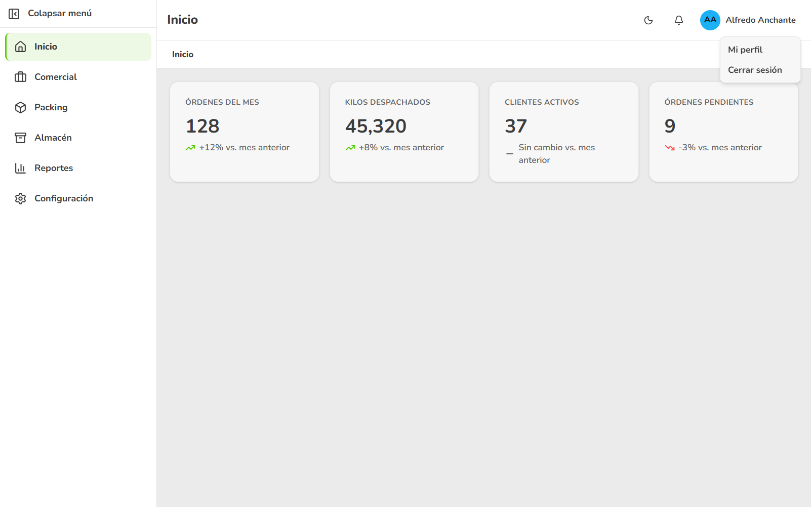
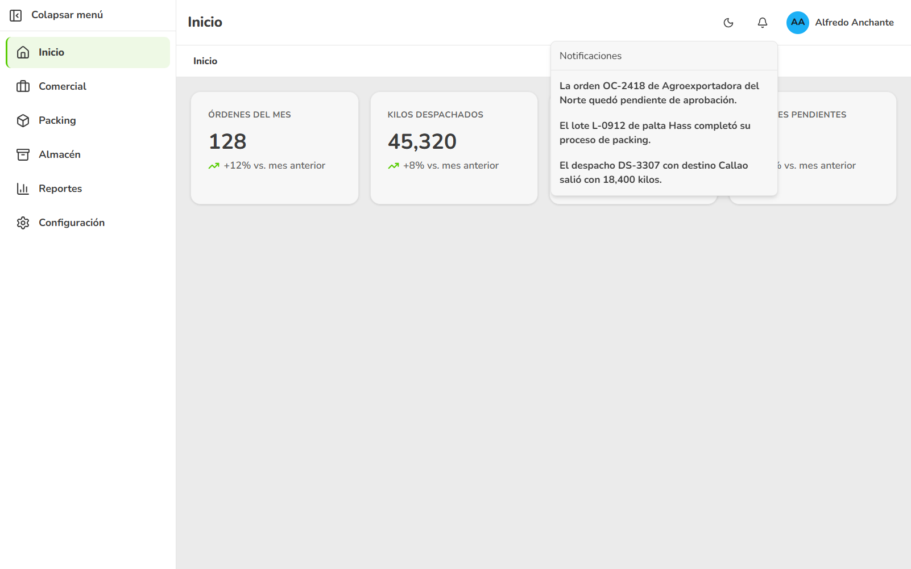
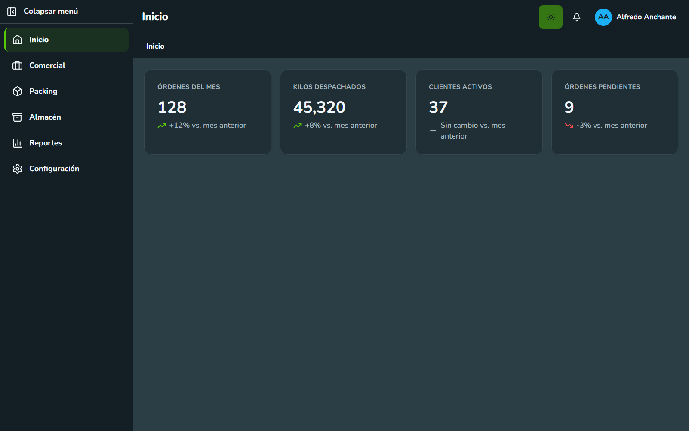
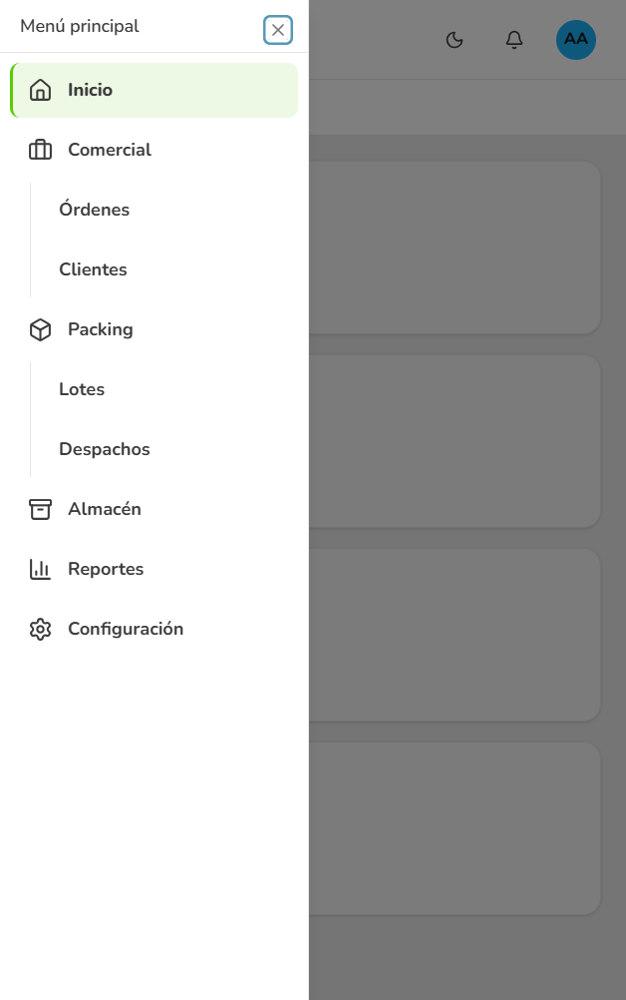

# Manual de Usuario — Layout Base y Pantalla Inicio

> **Versión:** 1.0 · **Fecha:** 2026-08-01 · **Sistema:** Layout / Dashboard Inicio

## ¿Qué es y para qué sirve?

Es la pantalla con la que arranca todo el sistema: un menú lateral para moverte
entre las áreas del negocio, una barra superior con tus accesos rápidos, y la
pantalla "Inicio" con los cuatro indicadores clave del negocio. Te sirve para
ubicarte de un vistazo apenas entras, moverte con confianza entre secciones y
tener el pulso del negocio (órdenes, kilos despachados, clientes y pendientes)
sin pedirle nada a nadie.

## ¿Quién puede usarla?

Cualquier persona que abra el sistema. En esta entrega todavía no hace falta
iniciar sesión (eso llega en una entrega posterior) y no existen roles ni
permisos diferentes: todos ven el mismo menú y pueden hacer exactamente lo
mismo.

## Antes de empezar

- Tener el sistema abierto en tu navegador, desde una computadora, tablet o
  teléfono.
- No necesitas usuario ni contraseña por ahora.

## Cómo usarla, paso a paso

### Recorrer el menú y ubicarte

Para qué: reconocer de un vistazo qué contiene el sistema y en qué parte estás
en cada momento.

#### Paso 1 — Abre el sistema

Abre el sistema desde tu navegador. No necesitas ingresar usuario ni
contraseña.

✅ **Verás:** la pantalla "Inicio" abierta, con el menú lateral a la izquierda,
la barra superior mostrando el título "Inicio" y las cuatro tarjetas con los
indicadores del negocio.

#### Paso 2 — Recorre el menú lateral

Mira el menú lateral. Vas a encontrar, en este orden, las secciones **Inicio**,
**Comercial**, **Packing**, **Almacén**, **Reportes** y **Configuración**.

✅ **Verás:** las seis secciones del negocio, una debajo de otra.

#### Paso 3 — Despliega una sección con subsecciones

Elige **Comercial** o **Packing** para ver sus subsecciones (Comercial tiene
**Órdenes** y **Clientes**; Packing tiene **Lotes** y **Despachos**).

✅ **Verás:** debajo de la sección elegida aparecen sus subsecciones.

#### Paso 4 — Entra a una subsección

Elige, por ejemplo, **Órdenes**.

✅ **Verás:** el menú marca "Órdenes" como la sección activa (con una barra de
color a su izquierda), la barra superior cambia su título a "Órdenes" y, justo
debajo, la ruta de navegación muestra "Inicio / Comercial / Órdenes".

#### Paso 5 — Vuelve a Inicio con la ruta de navegación

Elige **Inicio** en la ruta de navegación, arriba del contenido.

✅ **Verás:** vuelves directo a la pantalla Inicio.

> 💡 **Tip:** solo el primer nivel de la ruta ("Inicio") te lleva a otra
> pantalla. Los niveles del medio, como "Comercial", no navegan a ningún
> lado porque esas secciones no tienen pantalla propia todavía.

#### Paso 6 — Entra a una sección que todavía no tiene pantalla

Elige cualquier sección sin pantalla propia: **Órdenes**, **Clientes**,
**Lotes**, **Despachos**, **Almacén**, **Reportes** o **Configuración**.

✅ **Verás:** el título "En construcción" con un aviso que nombra la sección
elegida. El menú lateral y la barra superior se mantienen visibles alrededor.

#### Paso 7 — Colapsa el menú lateral para ganar espacio

Para qué: ver más contenido en pantalla dejando el menú reducido a iconos.

Elige el botón para colapsar el menú, en la parte superior del menú lateral.

✅ **Verás:** el menú lateral se reduce y muestra solo los iconos de cada
sección.

#### Paso 8 — Reconoce una sección con el menú colapsado

Apunta con el mouse (o el dedo, en pantalla táctil) sobre un icono del menú
colapsado.

✅ **Verás:** aparece una pequeña etiqueta con el nombre de esa sección.

#### Paso 9 — Expande el menú de nuevo

Elige el mismo botón para volver a expandirlo.

✅ **Verás:** el menú vuelve a mostrar el icono y el nombre de cada sección.

> 💡 **Tip:** si recargas el sistema, el menú siempre vuelve a abrirse
> expandido; esa parte no se recuerda entre visitas.

### Consultar los indicadores de la pantalla Inicio

Para qué: tener el pulso del negocio del periodo apenas abres el sistema.

#### Paso 10 — Mira las cuatro tarjetas de Inicio

En la pantalla Inicio vas a ver cuatro tarjetas: **Órdenes del mes**, **Kilos
despachados**, **Clientes activos** y **Órdenes pendientes**.

✅ **Verás:** cada tarjeta con su nombre, su valor, el texto de variación
respecto al mes anterior y una señal de tendencia.

#### Paso 11 — Interpreta la señal de tendencia

Cada tarjeta muestra, además del color, una señal que no depende de la vista
del color:

- Flecha hacia arriba: el indicador mejoró respecto al mes anterior.
- Flecha hacia abajo: el indicador bajó respecto al mes anterior.
- Raya horizontal: el indicador se mantuvo sin cambios.

✅ **Verás:** en esta entrega, "Órdenes del mes" y "Kilos despachados" suben,
"Clientes activos" se mantiene sin cambio y "Órdenes pendientes" baja.

> 💡 **Tip:** en esta entrega los cuatro valores son datos de ejemplo fijos,
> todavía no vienen de información real del negocio. La pantalla no incluye
> gráficos ni una tabla de actividad reciente.

### Reconocer cuándo un indicador está cargando, vacío o con problemas

Para qué: no confundir "todavía no llegó el dato" con "el valor es cero", y
saber qué hacer si algo falla.

#### Paso 12 — Mientras se busca la información

Cuando entras a Inicio, cada tarjeta conserva su nombre y muestra un anuncio
de carga en el lugar del valor mientras la información llega.

✅ **Verás:** una forma gris que se anima suavemente donde después va a
aparecer el valor.

#### Paso 13 — Si no hay información del periodo

Si un indicador no tiene datos para el periodo, la tarjeta lo explica en vez
de mostrar un valor inventado.

✅ **Verás:** el texto "Sin información para este periodo" en lugar del valor,
sin ningún texto de variación.

#### Paso 14 — Si el dato no se pudo obtener

Si un indicador no se pudo traer, la tarjeta lo avisa y te deja intentarlo de
nuevo.

✅ **Verás:** el texto "No se pudo obtener este indicador" junto con la
opción **Reintentar**.

#### Paso 15 — Reintenta

Elige **Reintentar** en esa tarjeta.

✅ **Verás:** la tarjeta vuelve al estado de carga y, si esta vez la
información llega bien, muestra su valor normalmente.

> 💡 **Tip:** un problema en una tarjeta nunca afecta a las otras tres —
> cada indicador se recupera por su cuenta.

### Usar el menú de usuario y las notificaciones

Para qué: reconocer dónde vivirán tu perfil, la salida del sistema y los
avisos del negocio.

#### Paso 16 — Abre tu menú de usuario

Elige tu avatar, en la esquina superior derecha de la barra superior.

✅ **Verás:** un menú con las opciones **Mi perfil** y **Cerrar sesión**.

#### Paso 17 — Elige una opción del menú de usuario

Elige **Mi perfil** o **Cerrar sesión**.

✅ **Verás:** un aviso indicando que esa opción todavía no está disponible.
No se cierra nada ni te saca del sistema: sigues exactamente donde estabas.

#### Paso 18 — Abre el panel de notificaciones

Elige la campana en la barra superior.

✅ **Verás:** el panel "Notificaciones" con tres avisos de ejemplo del
negocio.

#### Paso 19 — Elige un aviso

Elige cualquiera de los tres avisos del panel.

✅ **Verás:** el aviso se mantiene igual en el panel; en esta entrega elegirlo
no lo marca como leído ni lo saca de la lista.

#### Paso 20 — Cierra un panel abierto

Elige cualquier punto fuera del panel (notificaciones o menú de usuario), o
presiona la tecla **Escape**.

✅ **Verás:** el panel se cierra.

> 💡 **Tip:** solo un panel de la barra superior puede estar abierto a la
> vez. Si abres las notificaciones con el menú de usuario abierto, este
> último se cierra solo.

### Cambiar entre tema claro y tema oscuro

Para qué: trabajar más cómodo según la luz de tu ambiente o tu preferencia
personal.

#### Paso 21 — Cambia el tema

Elige el interruptor de tema en la barra superior.

✅ **Verás:** toda la pantalla cambia de aspecto, incluidos el menú lateral y
las tarjetas de indicador.

> 💡 **Tip:** el sistema recuerda tu elección. La próxima vez que lo abras,
> se va a mostrar directamente en el tema que dejaste la última vez, y se
> mantiene igual aunque cambies de sección.

### Usar el sistema desde el teléfono o solo con el teclado

Para qué: no depender de una pantalla grande ni de un mouse para moverte por
el sistema.

#### Paso 22 — Abre el sistema desde tu teléfono

Abre el sistema desde el navegador de tu teléfono.

✅ **Verás:** las cuatro tarjetas apiladas una debajo de otra y el menú
lateral oculto, sin ocupar espacio fijo junto al contenido.

#### Paso 23 — Abre el menú en el teléfono

Elige el botón de menú (icono de tres líneas).

✅ **Verás:** el menú aparece como un panel que se desliza por encima del
contenido.

#### Paso 24 — Cierra el menú deslizable

Elige una sección, toca un punto fuera del panel, o presiona **Escape**.

✅ **Verás:** el panel se oculta y vuelves a ver el contenido completo.

#### Paso 25 — Navega solo con el teclado

Si prefieres no usar mouse ni pantalla táctil, usa la tecla **Tab** para
pasar de un elemento a otro (el botón de colapsar menú, cada sección, el
interruptor de tema, la campana, tu avatar y el contenido) y **Enter** para
elegir el elemento donde estás.

✅ **Verás:** un contorno visible alrededor del elemento donde tienes el
foco, para saber siempre dónde estás parado.

## Casos frecuentes

### ¿Qué pasa si entro a una sección que todavía no tiene pantalla propia?

El sistema no te deja con la pantalla en blanco ni finge contenido: te avisa
con honestidad que esa pantalla llegará más adelante, y te deja seguir
navegando con normalidad al resto del sistema.

✅ **Verás:** "En construcción" y "La pantalla [Sección] estará disponible en
una entrega posterior."

### ¿Qué pasa si un indicador tarda en aparecer?

La tarjeta conserva su nombre y muestra un anuncio de carga en el lugar del
valor. No es un error: apenas llegue la información, el valor aparece solo.

### ¿Qué pasa si cierro el sistema y lo vuelvo a abrir?

El sistema recuerda únicamente el tema que elegiste (claro u oscuro). El
menú colapsado, la sección en la que estabas y los paneles abiertos no se
guardan: siempre vuelve a abrir en Inicio, con el menú expandido.

## Mensajes y avisos

Qué significan los mensajes que puede ver el usuario y cómo reaccionar.

| Mensaje en pantalla | Qué significa | Qué hacer |
|---|---|---|
| "La pantalla [Sección] estará disponible en una entrega posterior." | Esa sección todavía no tiene su pantalla lista en esta entrega. | Nada, es informativo. Puedes seguir navegando el resto del sistema con normalidad. |
| "Sin información para este periodo" | Ese indicador no tiene datos para el periodo actual. | Nada, no es un error; simplemente no hay información todavía. |
| "No se pudo obtener este indicador" | Hubo un problema al traer ese dato puntual. | Elige "Reintentar" en la misma tarjeta. |
| "Cerrar sesión estará disponible cuando se integre el inicio de sesión." | Esta opción todavía no funciona porque el sistema no exige iniciar sesión en esta entrega. | Nada, seguís usando el sistema con normalidad. |
| "Mi perfil estará disponible en una entrega posterior." | La pantalla de perfil todavía no existe. | Nada, es informativo. |
| "La orden OC-2418 de Agroexportadora del Norte quedó pendiente de aprobación." | Aviso de ejemplo del panel de notificaciones. | Nada, es un dato de muestra para esta entrega. |
| "El lote L-0912 de palta Hass completó su proceso de packing." | Aviso de ejemplo del panel de notificaciones. | Nada, es un dato de muestra para esta entrega. |
| "El despacho DS-3307 con destino Callao salió con 18,400 kilos." | Aviso de ejemplo del panel de notificaciones. | Nada, es un dato de muestra para esta entrega. |

## Preguntas frecuentes (FAQ)

**¿Por qué algunas secciones dicen que están "En construcción"?**
Porque esta primera entrega construyó el menú, la barra superior y la
pantalla Inicio: la base que van a usar todas las pantallas del sistema. El
resto de las pantallas (Órdenes, Clientes, Lotes, Despachos, Almacén,
Reportes y Configuración) llegan en entregas posteriores.

**¿Cómo cambio entre tema claro y tema oscuro?**
Con el interruptor de tema en la barra superior. El sistema recuerda tu
elección para la próxima vez que entres.

**¿Por qué no veo si una notificación ya la leí o no?**
Porque en esta entrega los tres avisos son de ejemplo: sirven para mostrar
cómo se va a ver el panel, todavía no distinguen entre leídos y no leídos.

**¿Los valores de las tarjetas de Inicio son datos reales del negocio?**
No. En esta entrega son datos de ejemplo fijos, pensados para revisar cómo
se ve la pantalla. Todavía no están conectados a información real.

**¿Necesito usuario y contraseña para entrar?**
No, todavía no. El sistema se abre directamente. El inicio de sesión llegará
en una entrega aparte.

**¿Por qué "Cerrar sesión" no me saca del sistema?**
Porque el inicio de sesión real todavía no existe. El aviso te lo explica y
te deja exactamente donde estabas, sin cerrar nada.

**¿Qué hago si un indicador muestra "No se pudo obtener este indicador"?**
Elige la opción "Reintentar" que aparece junto al mensaje, en esa misma
tarjeta. Los demás indicadores siguen funcionando con normalidad mientras
tanto.

## ¿Necesitas ayuda?

Si algo no funciona como se describe aquí, contacta al equipo de soporte del
sistema indicando qué paso estabas haciendo y, si puedes, una captura de lo
que viste.
